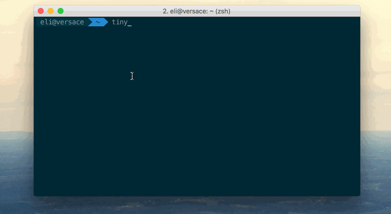

# tinytheater
A CLI interface for watching television shows and movies.
##Installation
`npm install tinytheater`
##Usage
```
Usage: tinytheater [options]

  Options:

    -h, --help               output usage information
    -V, --version            output the version number
    -m, --movie [name]       Search for a movie by its title.
    -t, --television [name]  Search for a television series by its title.
    -l, --link [torrent]     Stream torrent.
    -v, --verbose            Print everything that's going on.
```
##Example

